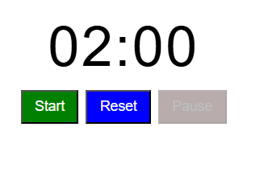
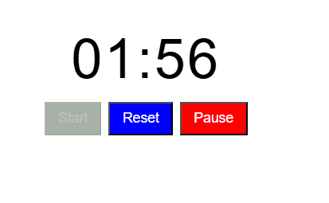
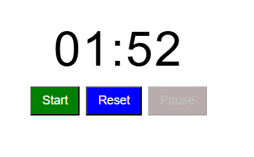

# Countdown-Timer-JS
A simple 2-minute countdown timer (mm:ss) built with vanilla JavaScript, HTML, and CSS. Includes a Reset button to restore 02:00

A minimal **mm:ss** countdown timer that starts from **02:00** and counts down to **00:00**.  
Includes **Start**, **Pause**, and **Reset** controls with proper button enable/disable states.  
Built with plain **JavaScript + HTML + CSS** (no frameworks).

---

## Features
- Starts at **02:00** and decrements every second to **00:00**
- **Start / Pause / Reset** controls
- Button states switch correctly (e.g., Start disabled while running)
- Simple, readable code structure (no build tools)

---

## Getting Started
1. Clone or download the repository.
2. Open `index.html` directly in a browser (or use a local server like VS Code **Live Server**).
3. Click **Start** to begin the countdown.

---

## How It Works (brief)
- Uses `setInterval` to tick every 1000 ms and update minutes/seconds.
- On **Pause** or **Reset** (or when reaching `00:00`), the active interval is cleared with `clearInterval`.
- Time formatting pads single digits to `mm:ss`.

---

## Screenshots

### Initial State (ready to start or after reset)

---

### Running (counting down, Pause enabled)

---

### Resumed after Pause (continues counting)

---

## Folder Structure

.
├── index.html

├── styles.css

├── app.js

└── img/

├── Pause.png

├── counting.png

└── start.png
